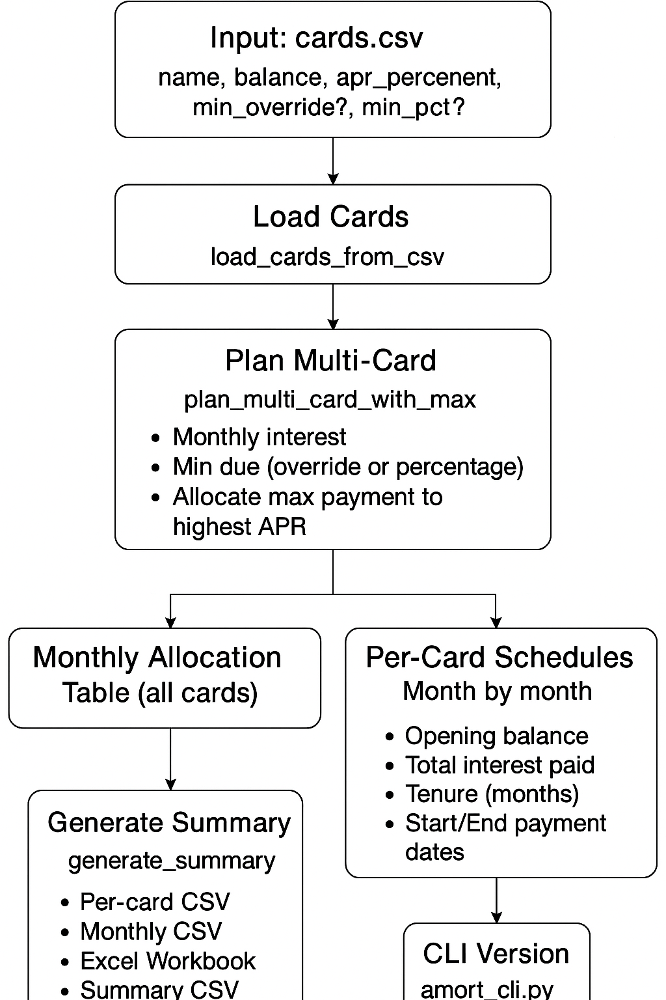

---

# 📂 `README.md`


# 💳 Payment Amortization Tool (Credit Card or Personal Loans)

A Python-based utility to plan and simulate **multi-card debt repayment** strategies with fixed maximum monthly payments, minimum due rules, and avalanche payoff logic.

---

## 🚀 Features

- **CSV-based input**  
  Upload a `cards.csv` with the following columns:
  - `Card` → Name/identifier
  - `Balance` → Starting balance
  - `APR` → Annual interest rate (decimal, e.g. 0.24 for 24%)
  - `Min_Pct` → (optional) Minimum payment as a % of balance  
  - `Min_Override` → (optional) Fixed minimum payment amount  

- **Minima handling**  
  - If `Min_Override` is given → it takes precedence as the exact minimum.  
  - If only `Min_Pct` is provided → minimum is computed as `% of balance`.  
  - If both are missing → minimum due is treated as `2% of balance + interest on balance amount before payment`.  

- **Budget guarantee**  
  - If your `Max Allowed Payment` is **less than the sum of all minima**, the system automatically raises the total monthly payment to at least that sum.  
  - This prevents **underpaying** minimum dues across cards.  

- **Avalanche payoff**  
  - Extra funds beyond the minima are always applied to the **highest-APR card** with a balance.  
  - Once that card is cleared, the next-highest APR card takes over the extra.  

- **Interest accrual**  
  - Interest compounds **monthly** at `APR / 12`.  
  - Payments are applied after interest accrual each cycle.  

- **Multiple interfaces**  
  - **CLI** → Run in terminal.  
  - **Streamlit App** → Simple dashboard with tables, charts, and downloads.  
  - **Gradio App** → Interactive web UI with Plotly charts and file downloads.  

---

## 📊 Outputs

- **Per-card schedules** (month-by-month: interest, payment, remaining balance).  
- **Monthly summary** (how much was paid to each card and total per cycle).  
- **Overall summary** (per card: months until payoff, total paid, total interest).  
- **Downloads**:
  - Excel workbook (all schedules in separate sheets).  
  - CSV exports (monthly allocation, summary, per-card schedules).  

---

## 🖼️ Architecture / Workflow

The flowchart below illustrates how the tool processes inputs, allocates payments, and generates outputs:




---

## 📦 Installation

1. Clone this repo or copy the files.
2. Install dependencies:
   ```bash
   pip install -r requirements.txt


### Example `requirements.txt`

```
pandas
streamlit
gradio
plotly
```

---

## ⚡ Usage

### CLI

```bash
python v5/amort_cli.py cards.csv --max 1000
```

### Streamlit

```bash
streamlit run v5/amort_streamlit.py
```

### Gradio

```bash
python v5/amort_gradio.py
```

---

## ✅ Example Behavior

Suppose you have:

* **Card A** → Balance 10,000 @ 24% APR, `Min_Override = 1549`
* **Card B** → Balance 5,000 @ 18% APR, `Min_Override = 1594`
* **Card C** → Balance 2,500 @ 12% APR, `Min_Override = 1638`

If user input `Max Allowed = 1000`:

* System detects sum of overrides = `4771`.
* Budget is raised to **4771**, not 1000.
* Each card gets its override (1549, 1594, 1638).
* Extra budget (if any above overrides) goes toward the highest-APR card.

---

## 🛡️ Safeguards

* Maximum simulation length: **600 months** (50 years).
* Payments never exceed balance.
* Empty/malformed CSV rows are skipped safely.

---

## ⚠️ Disclaimer

The **Amortization Schedule Tool** is provided for **informational and educational purposes only**. While we strive to ensure the accuracy of the calculations, the results generated by this tool are **estimates** and may not reflect actual loan terms, interest rates, fees, or other financial conditions.

Users should **not rely solely** on this tool for making financial, investment, or legal decisions. It is strongly recommended that you **consult with a qualified financial advisor, lender, or other professional** before taking any action based on the information provided by this tool.

We do not accept any liability for losses or damages resulting from the use of this tool. **By using this tool, you agree to use it at your own risk.**

---

## 📄 License

MIT — Free for personal and commercial use.

---

## Contact

For questions, feedback, or feature requests, reach out at **[itsmearvihar@gmail.com](mailto:itsmearvihar@gmail.com)**

